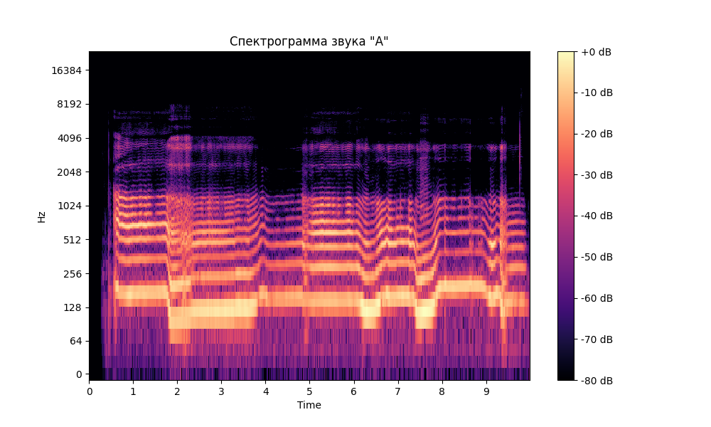
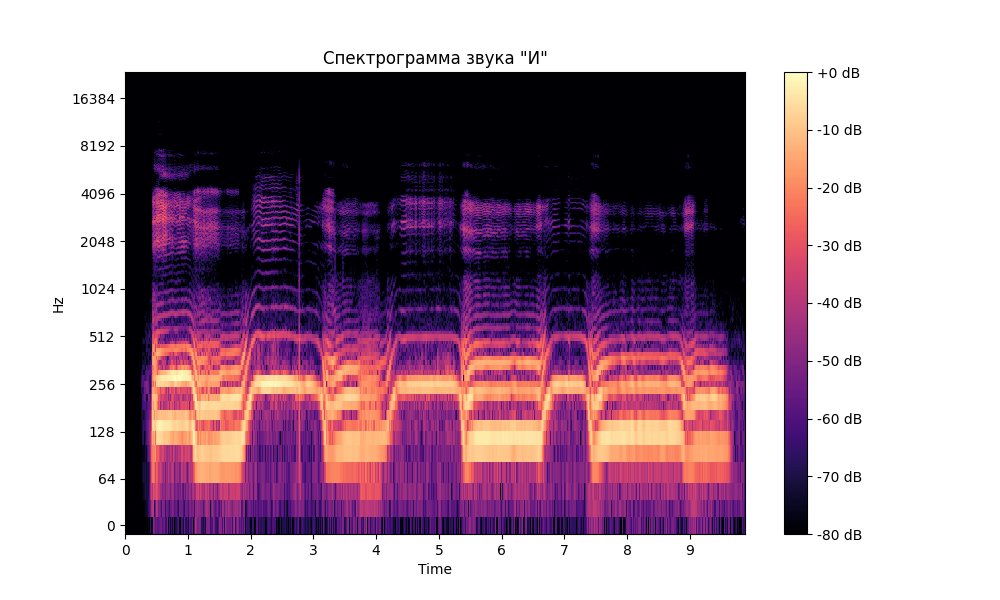
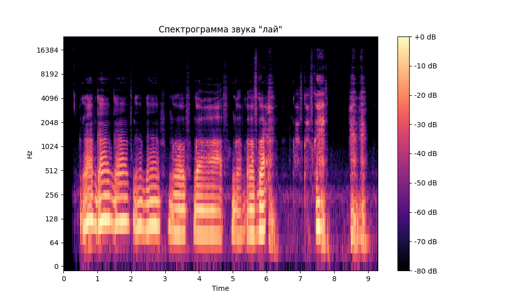

# Лабораторная работа №10. Обработка голоса

## Звук "А"
- Минимальная частота: 93.75 Гц
- Максимальная частота: 1031.25 Гц
- Основной тон с наибольшим количеством обертонов: 140.62 Гц
- Три самые сильные форманты: 140.62, 468.75, 585.94 Гц

## Звук "И"
- Минимальная частота: 70.31 Гц
- Максимальная частота: 375.00 Гц
- Основной тон с наибольшим количеством обертонов: 210.94 Гц
- Три самые сильные форманты: 117.19, 257.81, 703.12 Гц

## Звук "лай"
- Минимальная частота: 46.88 Гц
- Максимальная частота: 726.56 Гц
- Основной тон с наибольшим количеством обертонов: 117.19 Гц
- Три самые сильные форманты: 117.19, 328.12, 492.19 Гц

