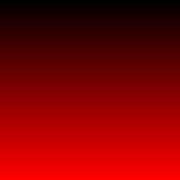
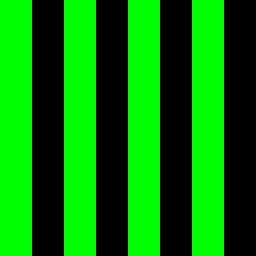
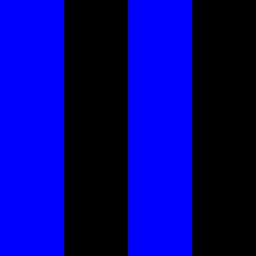
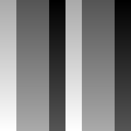
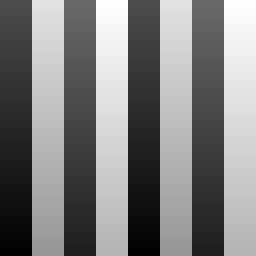
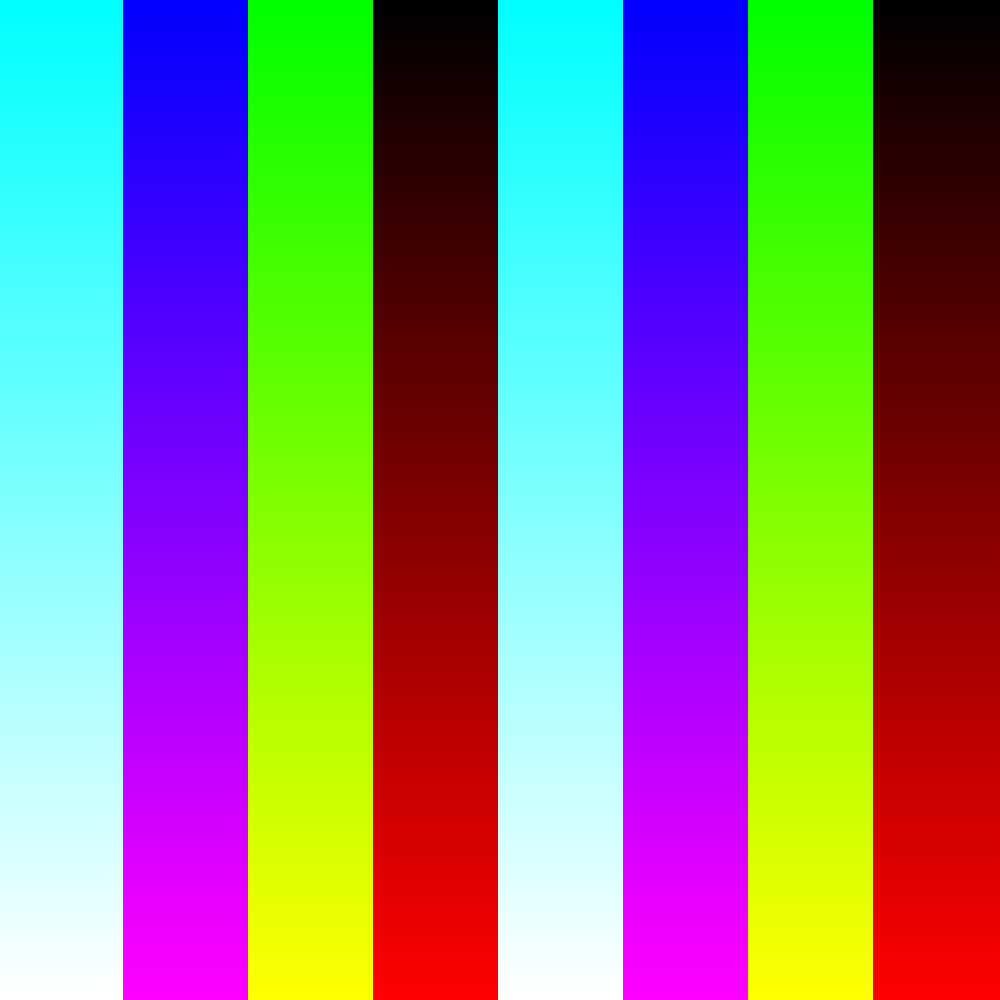
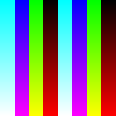
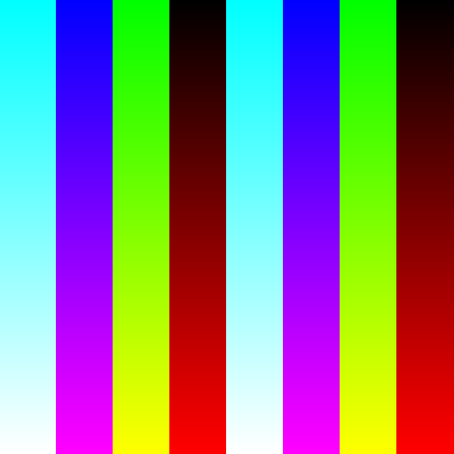
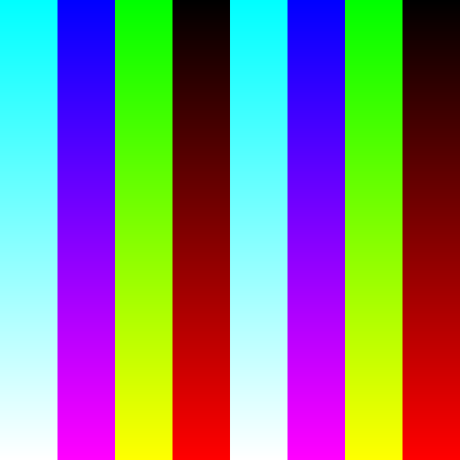

# Отчет по лабораторной работе

## 1. Выделение компонент R, G, B
Были разделены каналы изображения. Ниже представлены результаты:
- Канал R:  (Размер: 256x256)
- Канал G:  (Размер: 256x256)
- Канал B:  (Размер: 256x256)

## 2. Преобразование изображения в HSI
Ниже представлены компоненты:
- Яркостная компонента:  (Размер: 256x256)
- Инвертированная яркостная компонента:  (Размер: 256x256)

## 3. Изменение размера изображения

### 3.1 Изначальные размеры изображения
Размер изображения: 256x256

### 3.2 Растяжение (интерполяция)
Коэффициент растяжения: M = 4  
Результат растяжения:  (Размер: 1024x1024)

### 3.3 Сжатие (децимация)
Коэффициент сжатия: N = 2  
Результат сжатия:  (Размер: 128x128)

### 3.4 Передискретизация в два прохода (растяжение + сжатие)
Коэффициент: K = M / N = 2  
Результат передискретизации в два прохода:  (Размер: 512x512)

### 3.5 Передискретизация в один проход
Коэффициент: K = 2  
Результат передискретизации в один проход:  (Размер: 512x512)
