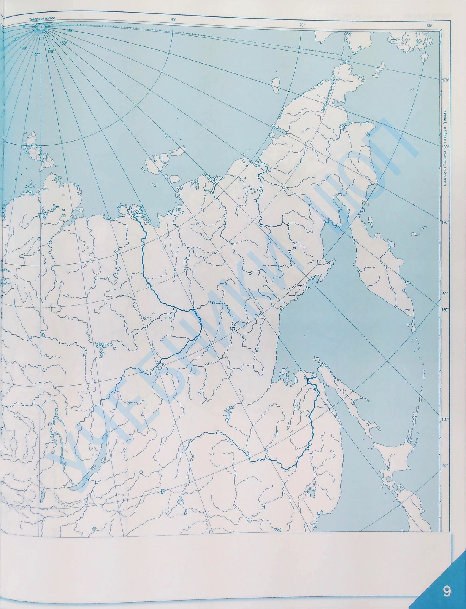

#Отчет по лабораторной работе №2

## Задание 1: Приведение полноцветного изображения к полутоновому
Полноцветное изображение было преобразовано в полутоновое с использованием взвешенного усреднения каналов. Формула для преобразования:
\[
I = 0.3 \cdot R + 0.59 \cdot G + 0.11 \cdot B
\]
где \( R, G, B \) — каналы исходного изображения, а \( I \) — яркость пикселя в полутоновом изображении.

## Задание 2: Приведение полутонового изображения к монохромному методом адаптивной бинаризации Брэдли и Рота
Для бинаризации использовался метод адаптивной бинаризации Брэдли и Рота с окном \( 5 	imes 5 \) и порогом \( 0.15 \). Этот метод позволяет адаптивно вычислять порог для каждого пикселя на основе локальной яркости в окрестности.

---

## Результаты обработки изображений

### 1. Изображение: `test_image.png`
- **Исходное изображение**:
  
- **Полутоновое изображение**:
  
- **Бинаризованное изображение**:
  

### 2. Изображение: `atlas.png`
- **Исходное изображение**:
  
- **Полутоновое изображение**:
  
- **Бинаризованное изображение**:
  

### 3. Изображение: `book.png`
- **Исходное изображение**:
  
- **Полутоновое изображение**:
  
- **Бинаризованное изображение**:
  

### 4. Изображение: `cartoon.png`
- **Исходное изображение**:
  
- **Полутоновое изображение**:
  
- **Бинаризованное изображение**:
  

### 5. Изображение: `cat.png`
- **Исходное изображение**:
  
- **Полутоновое изображение**:
  
- **Бинаризованное изображение**:
  

### 6. Изображение: `fingers.png`
- **Исходное изображение**:
  
- **Полутоновое изображение**:
  
- **Бинаризованное изображение**:
  

### 7. Изображение: `rentgen.png`
- **Исходное изображение**:
  
- **Полутоновое изображение**:
  
- **Бинаризованное изображение**:
  

---

## Параметры обработки
- **Метод преобразования в полутоновое изображение**: Взвешенное усреднение каналов (\( 0.3 \cdot R + 0.59 \cdot G + 0.11 \cdot B \)).
- **Метод бинаризации**: Адаптивная бинаризация Брэдли и Рота.
- **Размер окна**: \( 5 	imes 5 \).
- **Порог**: \( 0.15 \).