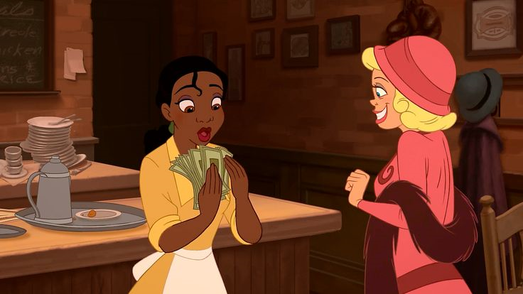

# Отчет по лабораторной работе №3

## Задание: Фильтрация изображений и морфологические операции
В данной работе применялся медианный фильтр с разреженной маской в виде прямого креста размером \( 3 	imes 3 \). Маска имеет следующий вид:

\[
010
111
010
\]

Для каждого изображения были получены:
1. Отфильтрованное монохромное изображение.
2. Разностное изображение (модуль разности между исходным и отфильтрованным изображениями).

---

## Результаты обработки изображений

### 1. Изображение: `test_image.png`
- **Исходное изображение**:
  
- **Отфильтрованное изображение**:
  
- **Разностное изображение**:
  

### 2. Изображение: `atlas.png`
- **Исходное изображение**:
  
- **Отфильтрованное изображение**:
  
- **Разностное изображение**:
  

### 3. Изображение: `book.png`
- **Исходное изображение**:
  
- **Отфильтрованное изображение**:
  
- **Разностное изображение**:
  

### 4. Изображение: `cartoon.png`
- **Исходное изображение**:
  
- **Отфильтрованное изображение**:
  
- **Разностное изображение**:
  

### 5. Изображение: `cat.png`
- **Исходное изображение**:
  
- **Отфильтрованное изображение**:
  
- **Разностное изображение**:
  

### 6. Изображение: `fingers.png`
- **Исходное изображение**:
  
- **Отфильтрованное изображение**:
  
- **Разностное изображение**:
  

### 7. Изображение: `rentgen.png`
- **Исходное изображение**:
  
- **Отфильтрованное изображение**:
  
- **Разностное изображение**:
  
  
### 8. Изображение: `output_binary_cat.png`
- **Исходное изображение**:
  
- **Отфильтрованное изображение**:
  
- **Разностное изображение**:
  

---

## Параметры обработки
- **Метод фильтрации**: Медианный фильтр.
- **Маска**: Прямой крест размером \( 3 	imes 3 \):
  \[
  010
  111
  010
  \]
- **Ранг фильтра**: 3/5 