# Лабораторная работа №5. Выделение признаков символов

## Вариант 25: Русские заглавные курсивные буквы

## Все сгенерированные символы

  

    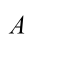
    
А

  

  

    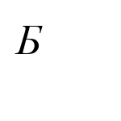
    
Б

  

  

    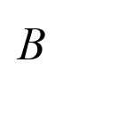
    
В

  

  

    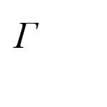
    
Г

  

  

    
    
Д

  

  

    
    
Е

  

  

    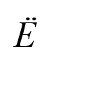
    
Ё

  

  

    
    
Ж

  

  

    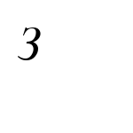
    
З

  

  

    
    
И

  

  

    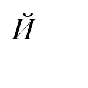
    
Й

  

  

    
    
К

  

  

    
    
Л

  

  

    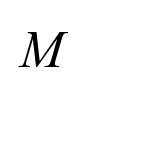
    
М

  

  

    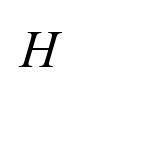
    
Н

  

  

    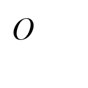
    
О

  

  

    
    
П

  

  

    
    
Р

  

  

    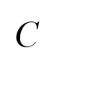
    
С

  

  

    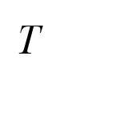
    
Т

  

  

    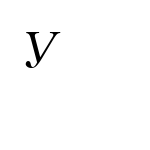
    
У

  

  

    
    
Ф

  

  

    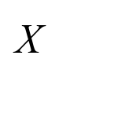
    
Х

  

  

    
    
Ц

  

  

    
    
Ч

  

  

    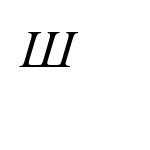
    
Ш

  

  

    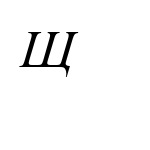
    
Щ

  

  

    
    
Ъ

  

  

    
    
Ы

  

  

    
    
Ь

  

  

    
    
Э

  

  

    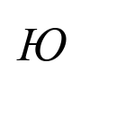
    
Ю

  

  

    
    
Я

  

## Профили символов

### Символ А

  

    
  

  

    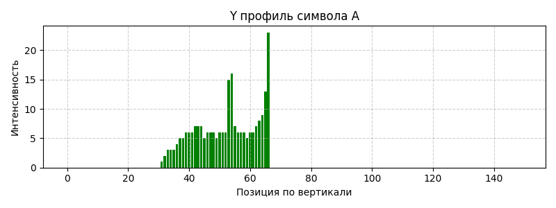
  

### Символ Б

  

    
  

  

    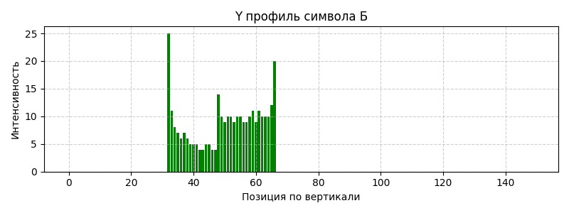
  

### Символ В

  

    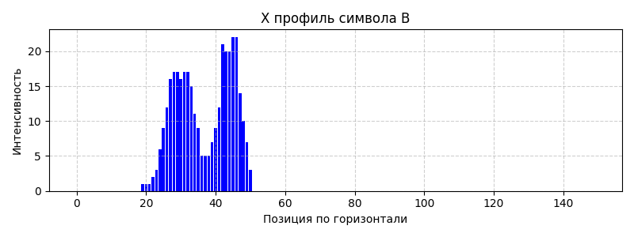
  

  

    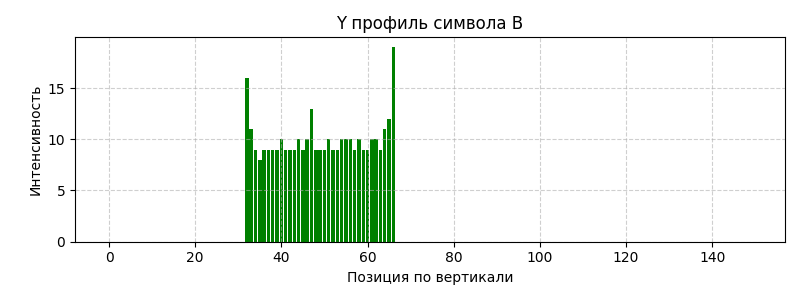
  

### Символ Г

  

    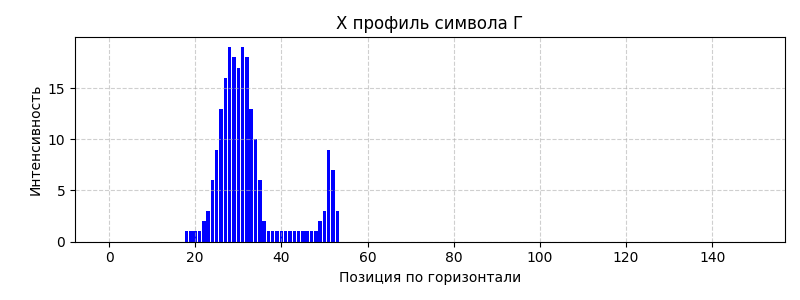
  

  

    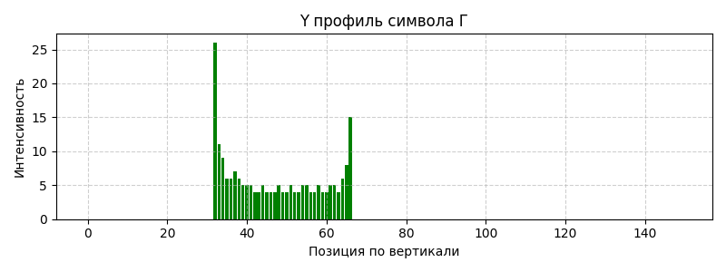
  

### Символ Д

  

    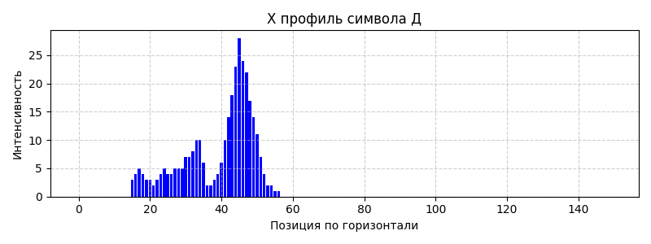
  

  

    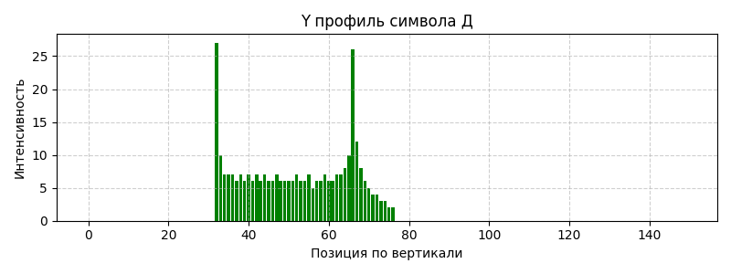
  

### Символ Е

  

    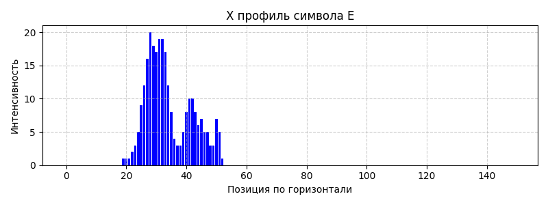
  

  

    
  

### Символ Ё

  

    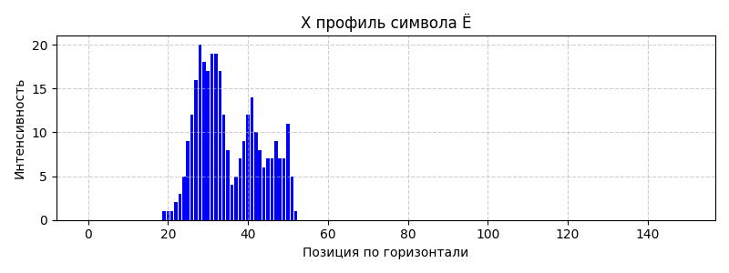
  

  

    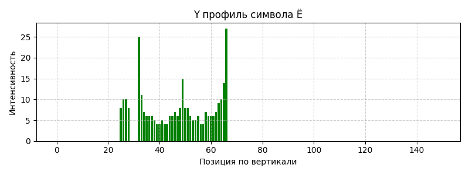
  

### Символ Ж

  

    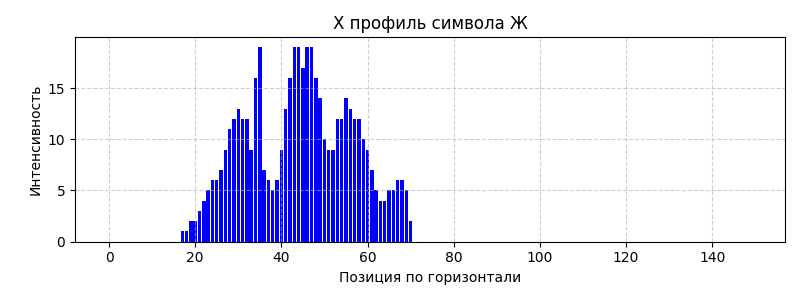
  

  

    
  

### Символ З

  

    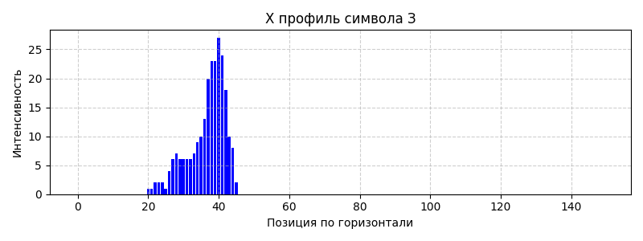
  

  

    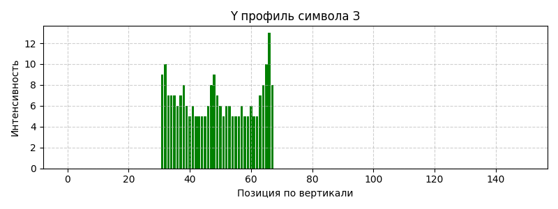
  

### Символ И

  

    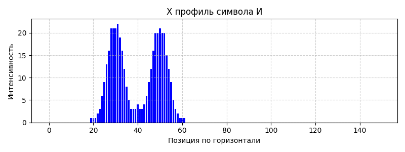
  

  

    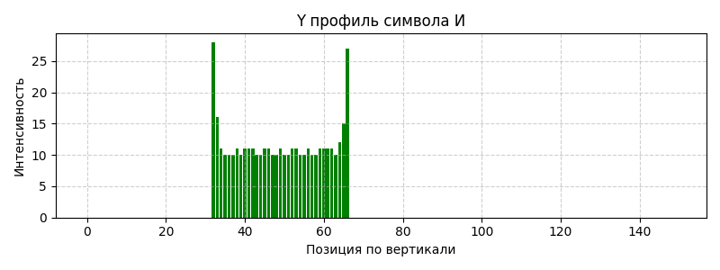
  

### Символ Й

  

    
  

  

    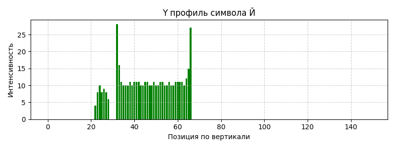
  

### Символ К

  

    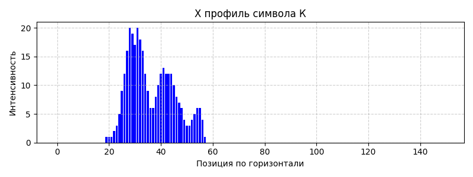
  

  

    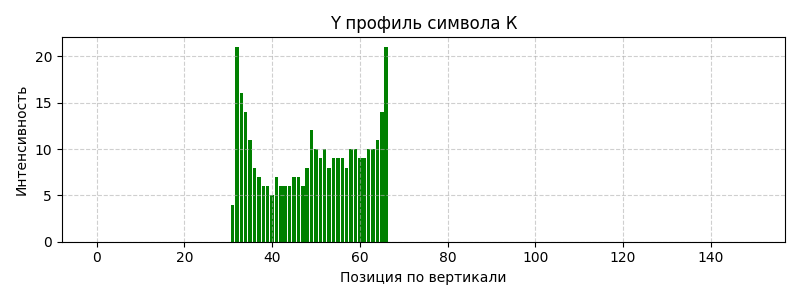
  

### Символ Л

  

    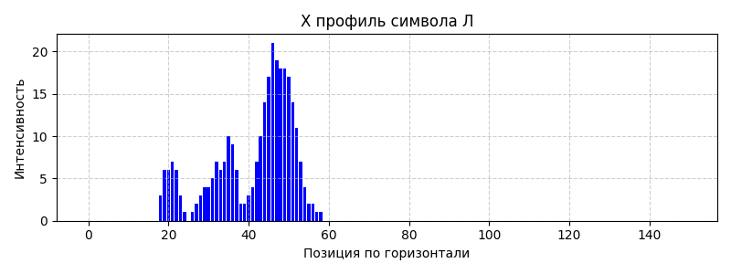
  

  

    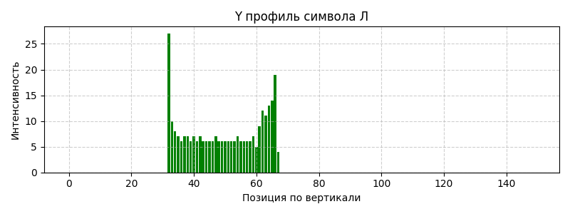
  

### Символ М

  

    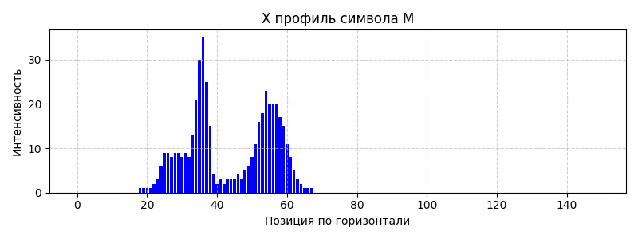
  

  

    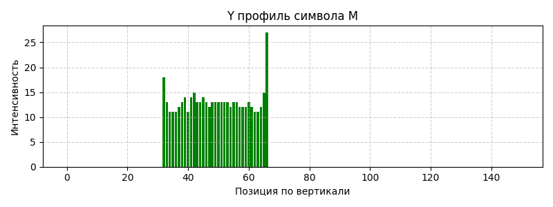
  

### Символ Н

  

    
  

  

    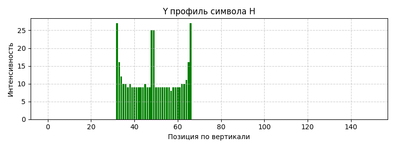
  

### Символ О

  

    
  

  

    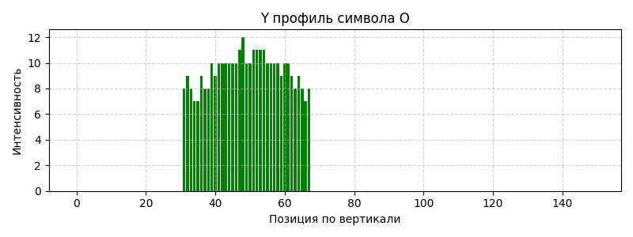
  

### Символ П

  

    
  

  

    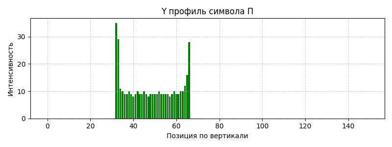
  

### Символ Р

  

    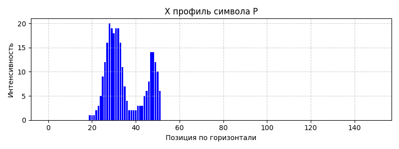
  

  

    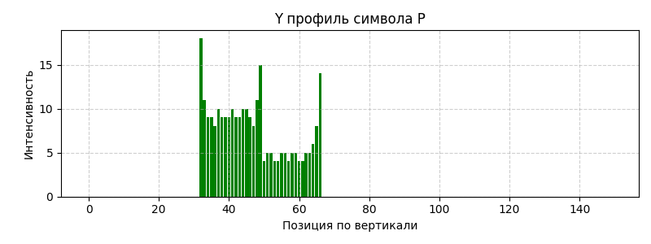
  

### Символ С

  

    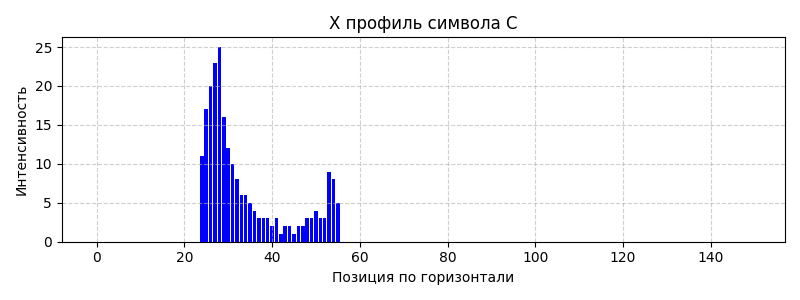
  

  

    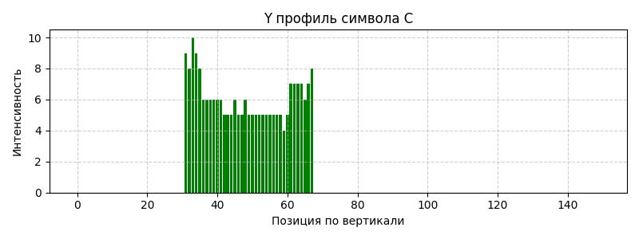
  

### Символ Т

  

    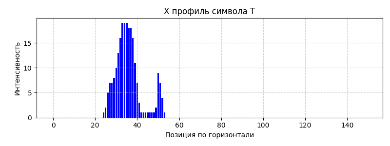
  

  

    
  

### Символ У

  

    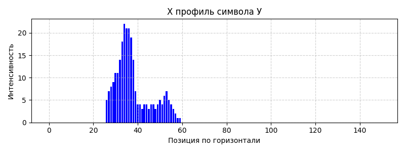
  

  

    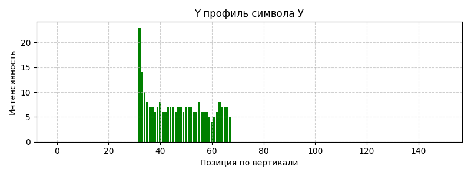
  

### Символ Ф

  

    
  

  

    
  

### Символ Х

  

    
  

  

    
  

### Символ Ц

  

    
  

  

    
  

### Символ Ч

  

    
  

  

    
  

### Символ Ш

  

    
  

  

    
  

### Символ Щ

  

    
  

  

    
  

### Символ Ъ

  

    
  

  

    
  

### Символ Ы

  

    
  

  

    
  

### Символ Ь

  

    
  

  

    
  

### Символ Э

  

    
  

  

    
  

### Символ Ю

  

    
  

  

    
  

### Символ Я

  

    
  

  

    
  

## Таблица признаков

Полные данные доступны в [файле features.csv](features.csv)

| Символ   |   Вес Q1 |   Вес Q2 |   Вес Q3 |   Вес Q4 |   Уд.вес Q1 |   Уд.вес Q2 |   Уд.вес Q3 |   Уд.вес Q4 |   Центр X |   Центр Y |   Норм.центр X |   Норм.центр Y |   Момент X |   Момент Y |   Норм.момент X |   Норм.момент Y |   Ширина |   Высота |
|:---------|---------:|---------:|---------:|---------:|------------:|------------:|------------:|------------:|----------:|----------:|---------------:|---------------:|-----------:|-----------:|----------------:|----------------:|---------:|---------:|
| А        |      244 |        0 |        0 |        0 |   0.0433778 | 0           | 0           |           0 |   38.1107 |   52.2336 |       0.254071 |       0.348224 |    23767.7 |   12184    |      0.00432927 |      0.00221931 |      150 |      150 |
| Б        |      314 |        0 |        0 |        0 |   0.0558222 | 0           | 0           |           0 |   35.5828 |   50.3057 |       0.237219 |       0.335372 |    38506.6 |   19886.3  |      0.00545034 |      0.00281477 |      150 |      150 |
| В        |      352 |        0 |        0 |        0 |   0.0625778 | 0           | 0           |           0 |   36.7188 |   49.3977 |       0.244792 |       0.329318 |    39160.3 |   21753.2  |      0.00494448 |      0.00274661 |      150 |      150 |
| Г        |      211 |        0 |        0 |        0 |   0.0375111 | 0           | 0           |           0 |   32.4645 |   47.2085 |       0.21643  |       0.314724 |    29664.8 |   13800.5  |      0.00624851 |      0.00290689 |      150 |      150 |
| Д        |      318 |        0 |        4 |        0 |   0.0565333 | 0           | 0.000711111 |           0 |   39.3478 |   52.1118 |       0.262319 |       0.347412 |    55826   |   31169    |      0.00770545 |      0.00430215 |      150 |      150 |
| Е        |      273 |        0 |        0 |        0 |   0.0485333 | 0           | 0           |           0 |   34.2491 |   49.8645 |       0.228327 |       0.33243  |    37104   |   15837.1  |      0.00604053 |      0.00257828 |      150 |      150 |
| Ё        |      309 |        0 |        0 |        0 |   0.0549333 | 0           | 0           |           0 |   35.3528 |   47.1424 |       0.235685 |       0.314283 |    54507.7 |   19482.6  |      0.00784002 |      0.00280224 |      150 |      150 |
| Ж        |      506 |        0 |        0 |        0 |   0.0899556 | 0           | 0           |           0 |   44.3123 |   49.581  |       0.295415 |       0.33054  |    65573.2 |   75722.7  |      0.00575961 |      0.00665109 |      150 |      150 |
| З        |      244 |        0 |        0 |        0 |   0.0433778 | 0           | 0           |           0 |   36.7049 |   49.0902 |       0.244699 |       0.327268 |    32034   |    6860.75 |      0.00583498 |      0.00124968 |      150 |      150 |
| И        |      413 |        0 |        0 |        0 |   0.0734222 | 0           | 0           |           0 |   39.845  |   49      |       0.265634 |       0.326667 |    50254   |   46518.1  |      0.00540802 |      0.00500598 |      150 |      150 |
| Й        |      466 |        0 |        0 |        0 |   0.0828444 | 0           | 0           |           0 |   40.6373 |   46.2811 |       0.270916 |       0.308541 |    77270.2 |   50293.7  |      0.00736959 |      0.00479673 |      150 |      150 |
| К        |      339 |        0 |        0 |        0 |   0.0602667 | 0           | 0           |           0 |   36.4749 |   49.2596 |       0.243166 |       0.328397 |    43889.2 |   26022.5  |      0.00575407 |      0.00341167 |      150 |      150 |
| Л        |      290 |        0 |        0 |        0 |   0.0515556 | 0           | 0           |           0 |   41.3069 |   49.7172 |       0.275379 |       0.331448 |    40514.8 |   28891.7  |      0.00620917 |      0.00442784 |      150 |      150 |
| М        |      461 |        0 |        0 |        0 |   0.0819556 | 0           | 0           |           0 |   43.6811 |   49.3297 |       0.291208 |       0.328865 |    49781.9 |   65732.1  |      0.00479941 |      0.00633715 |      150 |      150 |
| Н        |      407 |        0 |        0 |        0 |   0.0723556 | 0           | 0           |           0 |   39.86   |   48.8673 |       0.265733 |       0.325782 |    48054.8 |   45021    |      0.00524759 |      0.0049163  |      150 |      150 |
| О        |      348 |        0 |        0 |        0 |   0.0618667 | 0           | 0           |           0 |   39.6724 |   49.1868 |       0.264483 |       0.327912 |    35822.9 |   48010.7  |      0.00457508 |      0.00613163 |      150 |      150 |
| П        |      397 |        0 |        0 |        0 |   0.0705778 | 0           | 0           |           0 |   40.0151 |   48.2317 |       0.266767 |       0.321545 |    53644.7 |   44945.9  |      0.00600556 |      0.00503173 |      150 |      150 |
| Р        |      275 |        0 |        0 |        0 |   0.0488889 | 0           | 0           |           0 |   35.16   |   46.68   |       0.2344   |       0.3112   |    29923.8 |   20657    |      0.00483618 |      0.0033385  |      150 |      150 |
| С        |      225 |        0 |        0 |        0 |   0.04      | 0           | 0           |           0 |   33.8533 |   48.24   |       0.225689 |       0.3216   |    29761   |   20842.2  |      0.00587872 |      0.00411697 |      150 |      150 |
| Т        |      229 |        0 |        0 |        0 |   0.0407111 | 0           | 0           |           0 |   35.8472 |   46.5939 |       0.238981 |       0.310626 |    31929.2 |    9447.65 |      0.00619684 |      0.00183361 |      150 |      150 |
| У        |      262 |        0 |        0 |        0 |   0.0465778 | 0           | 0           |           0 |   37.9198 |   47.3359 |       0.252799 |       0.315573 |    31986.4 |   16915.3  |      0.00542603 |      0.00286943 |      150 |      150 |
| Ф        |      430 |        0 |        0 |        0 |   0.0764444 | 0           | 0           |           0 |   41.8721 |   49.0163 |       0.279147 |       0.326775 |    36550.9 |   45944    |      0.00377787 |      0.00474873 |      150 |      150 |
| Х        |      290 |        0 |        0 |        0 |   0.0515556 | 0           | 0           |           0 |   37.5517 |   48.9345 |       0.250345 |       0.32623  |    39937.8 |   16855.7  |      0.00612073 |      0.00258325 |      150 |      150 |
| Ц        |      412 |        0 |        3 |        0 |   0.0732444 | 0           | 0.000533333 |           0 |   40.4771 |   50.5373 |       0.269847 |       0.336916 |    61715.2 |   47171.5  |      0.00660939 |      0.00505184 |      150 |      150 |
| Ч        |      309 |        0 |        0 |        0 |   0.0549333 | 0           | 0           |           0 |   42.0906 |   46.0647 |       0.280604 |       0.307098 |    34118.7 |   23797.5  |      0.0049074  |      0.00342286 |      150 |      150 |
| Ш        |      596 |        4 |        0 |        0 |   0.105956  | 0.000711111 | 0           |           0 |   48.0217 |   49.9967 |       0.320144 |       0.333311 |    79806   |  141115    |      0.00591156 |      0.0104529  |      150 |      150 |
| Щ        |      619 |        4 |        2 |        0 |   0.110044  | 0.000711111 | 0.000355556 |           0 |   48.7856 |   50.8208 |       0.325237 |       0.338805 |    89839.9 |  149435    |      0.00638862 |      0.0106265  |      150 |      150 |
| Ъ        |      341 |        0 |        0 |        0 |   0.0606222 | 0           | 0           |           0 |   37.8739 |   50.6745 |       0.252493 |       0.33783  |    41268.9 |   17195.6  |      0.0053788  |      0.0022412  |      150 |      150 |
| Ы        |      500 |        0 |        0 |        0 |   0.0888889 | 0           | 0           |           0 |   43.148  |   50.894  |       0.287653 |       0.339293 |    58435.4 |   83485    |      0.00519426 |      0.00742089 |      150 |      150 |
| Ь        |      315 |        0 |        0 |        0 |   0.056     | 0           | 0           |           0 |   34.3238 |   52.1079 |       0.228825 |       0.347386 |    33316.3 |   14549    |      0.00470072 |      0.00205276 |      150 |      150 |
| Э        |      277 |        0 |        0 |        0 |   0.0492444 | 0           | 0           |           0 |   42.1733 |   48.0614 |       0.281155 |       0.320409 |    36548   |   18815.7  |      0.00586409 |      0.00301896 |      150 |      150 |
| Ю        |      586 |        0 |        0 |        0 |   0.104178  | 0           | 0           |           0 |   47.0307 |   49.1502 |       0.313538 |       0.327668 |    66340.8 |  140919    |      0.00503153 |      0.0106879  |      150 |      150 |
| Я        |      395 |        0 |        0 |        0 |   0.0702222 | 0           | 0           |           0 |   38.8658 |   49.1772 |       0.259105 |       0.327848 |    44813.6 |   31401.9  |      0.00504232 |      0.00353326 |      150 |      150 |