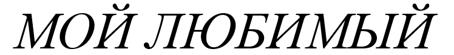
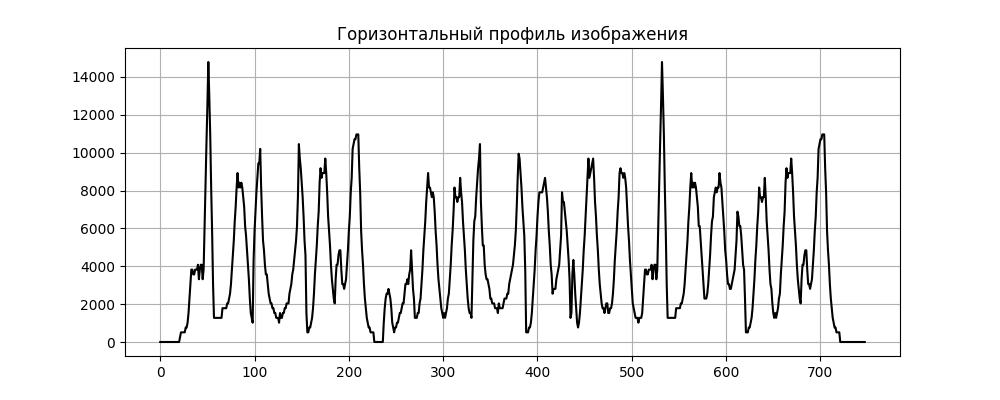
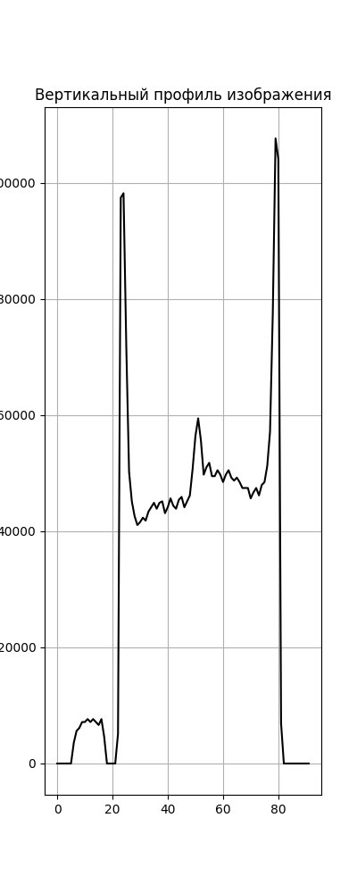

# Лабораторная работа №6
## *Сегментация текста и анализ символов*

### Цель работы:
Исследование методов сегментации строк на символы.
Реализация алгоритма сегментации с учётом особенностей курсивного шрифта.

## 1. Подготовка изображения
Для работы была подготовлена фраза на русском языке (заглавные буквы) в Microsoft Word 
с использованием курсивного шрифта. Скриншот был сохранён в файл `phrase.bmp` в монохромном формате без белого фона вокруг строки.

> Пример исходного изображения:

## 2. Бинаризация и инвертирование
Изображение было загружено в градациях серого и преобразовано в бинарное изображение методом пороговой обработки (`cv2.THRESH_BINARY_INV`). Это позволило выделить символы как светлые области на тёмном фоне.

## 3. Расчёт профилей изображения
Для всего изображения были вычислены профили активности пикселей:
- **Горизонтальный профиль** — сумма пикселей по столбцам
- **Вертикальный профиль** — сумма пикселей по строкам

## 4. Улучшенный алгоритм сегментации курсивного текста
Для компенсации наклона курсива реализован следующий подход:
1. Поворот изображения на -12° для выравнивания символов
2. Сегментация на повернутом изображении
3. Обратное преобразование координат для возврата к исходной ориентации

> Результат сегментации:

## 5. [Дополнительно] Общий обрамляющий прямоугольник
Рассчитан и отрисован общий ограничивающий прямоугольник для всей строки текста:

## Заключение
Алгоритм успешно справляется с задачей сегментации строки на отдельные символы даже в случае курсивного шрифта.
Благодаря применению динамического порога и предварительной компенсации наклона удалось минимизировать ошибки склеивания или разрыва букв.
