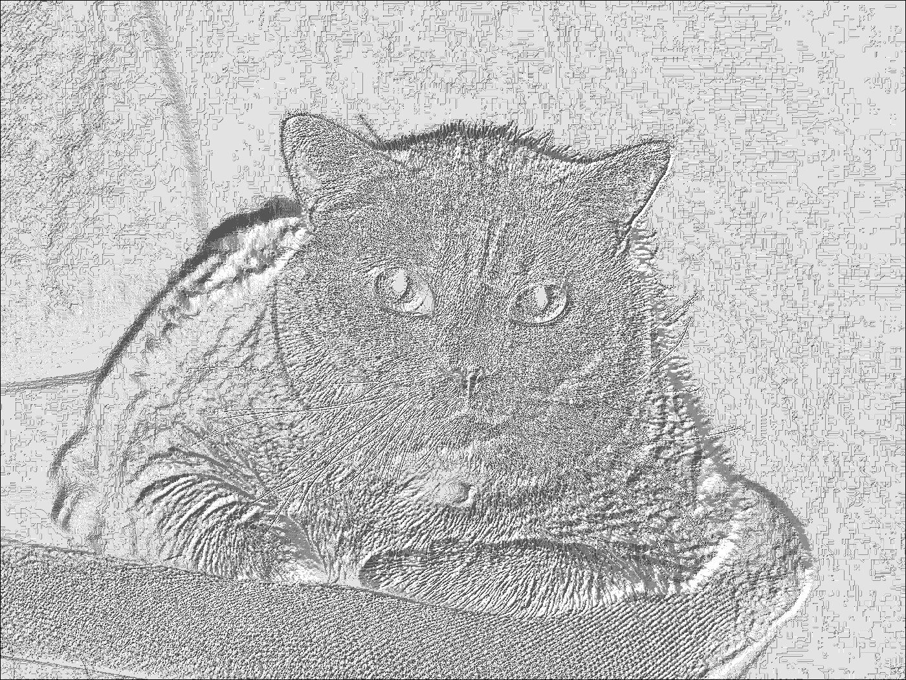

# Отчёт по лабораторной работе №8 (Вариант 5)

**Параметры:**
- Гамма-коррекция: γ = 1.5
- Радиус LBP: 1

## Результаты для изображения: cat

### 1. Исходное и контрастированное изображение
 | 
:-:|:-:
Исходное (RGB) | После гамма-коррекции (γ = 1.5)

### 2. Гистограммы яркости
 | 
:-:|:-:
До преобразования | После преобразования

### 3. LBP-анализ
 | 
:-:|:-:
LBP-карта (оригинал) | LBP-карта (после коррекции)

 | 
:-:|:-:
Гистограмма LBP-кодов (оригинал) | Гистограмма LBP-кодов (коррекция)

### 4. Текстурные признаки
| Метрика       | Исходное | После коррекции |
|--------------|----------|-----------------|
| Энтропия LBP | 2.6773 | 2.5888 |

### Выводы для cat
- После гамма-коррекции (γ = 1.5) яркость изображения увеличилась.
- Энтропия LBP уменьшилась, что означает ослабление текстурных особенностей.

## Результаты для изображения: cartoon

### 1. Исходное и контрастированное изображение
 | 
:-:|:-:
Исходное (RGB) | После гамма-коррекции (γ = 1.5)

### 2. Гистограммы яркости
 | 
:-:|:-:
До преобразования | После преобразования

### 3. LBP-анализ
 | 
:-:|:-:
LBP-карта (оригинал) | LBP-карта (после коррекции)

 | 
:-:|:-:
Гистограмма LBP-кодов (оригинал) | Гистограмма LBP-кодов (коррекция)

### 4. Текстурные признаки
| Метрика       | Исходное | После коррекции |
|--------------|----------|-----------------|
| Энтропия LBP | 2.7769 | 2.6364 |

### Выводы для cartoon
- После гамма-коррекции (γ = 1.5) яркость изображения увеличилась.
- Энтропия LBP уменьшилась, что означает ослабление текстурных особенностей.

## Результаты для изображения: atlas

### 1. Исходное и контрастированное изображение
 | 
:-:|:-:
Исходное (RGB) | После гамма-коррекции (γ = 1.5)

### 2. Гистограммы яркости
 | 
:-:|:-:
До преобразования | После преобразования

### 3. LBP-анализ
 | 
:-:|:-:
LBP-карта (оригинал) | LBP-карта (после коррекции)

 | 
:-:|:-:
Гистограмма LBP-кодов (оригинал) | Гистограмма LBP-кодов (коррекция)

### 4. Текстурные признаки
| Метрика       | Исходное | После коррекции |
|--------------|----------|-----------------|
| Энтропия LBP | 2.7654 | 2.7654 |

### Выводы для atlas
- После гамма-коррекции (γ = 1.5) яркость изображения увеличилась.
- Энтропия LBP уменьшилась, что означает ослабление текстурных особенностей.

