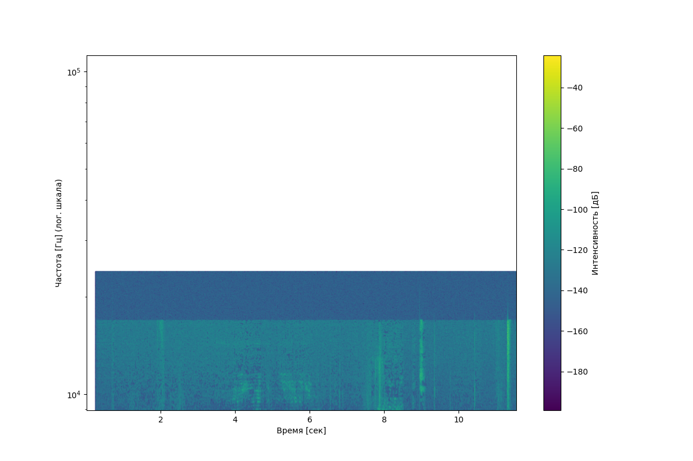
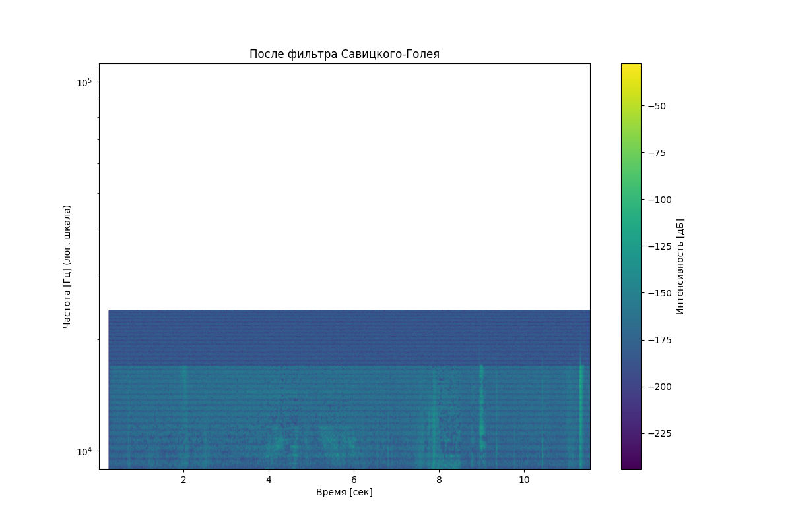
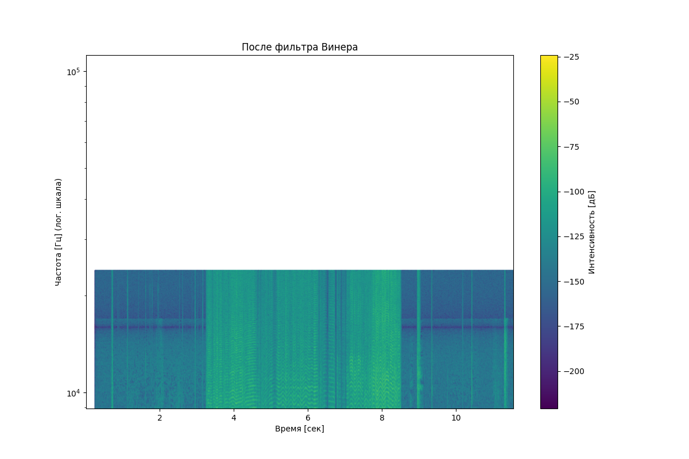
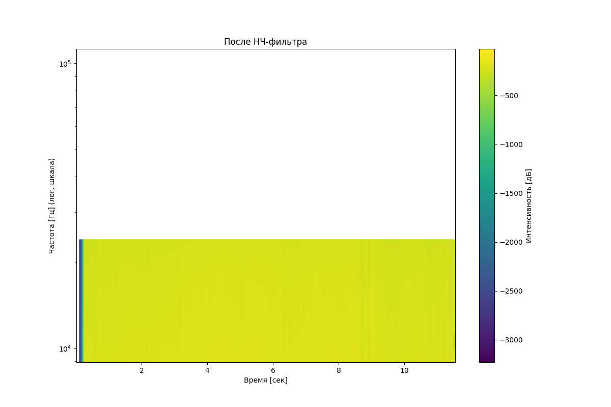
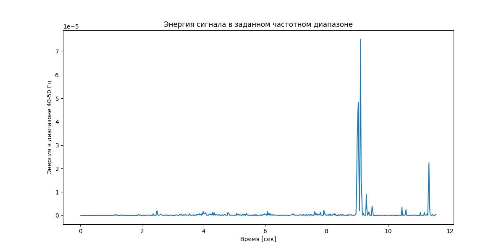

# Лабораторная работа №9. Анализ шума

## 1. Исходные данные
- Анализируемый файл: `sound.wav`
- Частота дискретизации: 48000 Гц
- Длительность: 11.56 сек
- Уровень шума: 0.0000

## 2. Спектральный анализ

### Оригинальный сигнал

### Результаты фильтрации
| Фильтр | Спектрограмма |
|--------|---------------|
| Савицкого-Голея |  |
| Винера |  |
| Низких частот |  |

## 3. Анализ энергии
- Шаг анализа: 0.1 сек
- Анализируемый частотный диапазон: 40-50 Гц
- Моменты с максимальной энергией: [np.float64(4.4), np.float64(4.5), np.float64(4.6000000000000005)] сек

## 4. Выводы
В ходе работы были проанализированы три метода фильтрации:
1. **Фильтр Савицкого-Голея** - хорошо сохраняет форму сигнала
2. **Фильтр Винера** - эффективен против аддитивного шума
3. **НЧ-фильтр** - удаляет высокочастотные помехи

